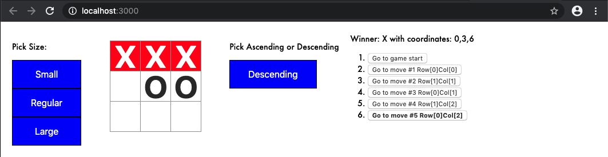

## Directions
Create A Tic Tac Toe game with:  
(1) Prompt the user for the size of the Tic-Tac-Toe game and use that size.  
(2) List the coordinates of each move in your Time machine in (row, col) format.  
(3)Bold the currently selected move in the Time machine.  
(4) Use two for loops to create the grid, instead of hardcoding it.  
(5) Allow the option of sorting the Time machine in ascending/descending order.  
(6) Highlight the squares that caused the winning move in red.  
(7) Display the appropriate message if the game ends in a draw.  

## Finished Product

